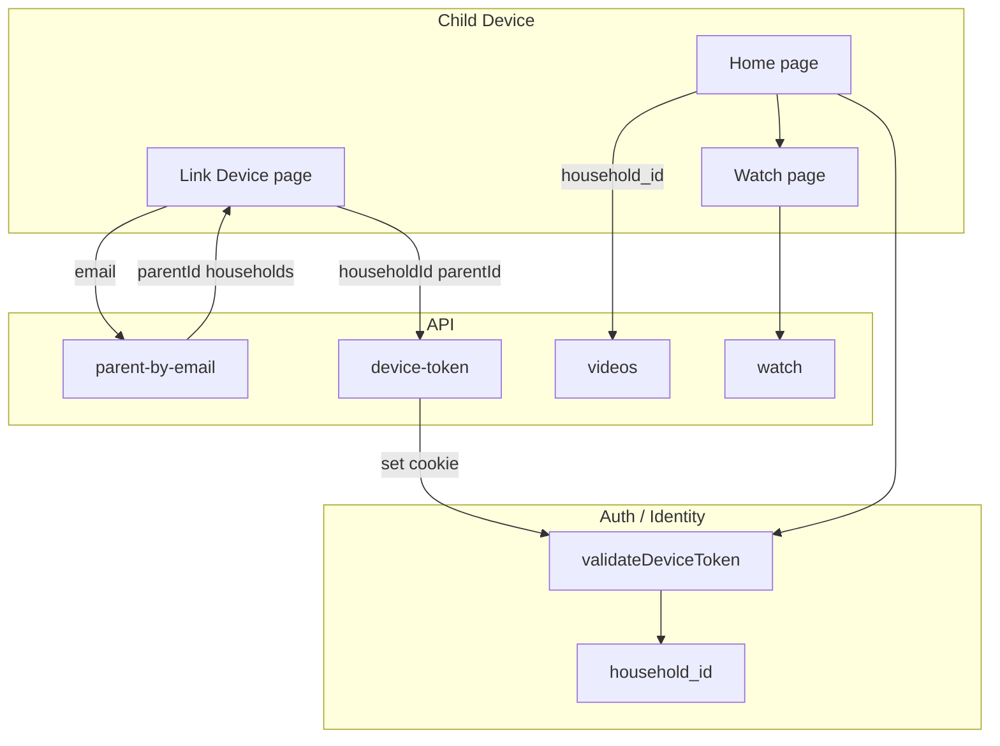

# SafeTube Architecture Analysis & Recommendations

**Date:** 2025-01-29 (updated 2026-02-04)  
**Reviewer:** Architect Agent  
**Codebase:** SafeTube (ZooTube) - Parent-curated YouTube video platform for children

---

## Executive Summary

This codebase is a Next.js application that allows parents to curate YouTube videos for their children. The application has a solid foundation; service/repository layers and households are in place. Security and code-quality improvements remain (see Phase 1 Security Report and refactor priorities below).

**Overall Assessment (2026-02-04 update):**
- **Architecture:** 🟢 GOOD - Service and repository layers exist; households and device tokens implemented; APIs are thin.
- **Security:** 🟡 MEDIUM - Rate limiting and minimal responses on parent-by-email; device-token fallback (cookie-only) is a known risk; dependency vulnerabilities (Next.js, jws, lodash) need addressing.
- **Code Quality:** 🟡 MEDIUM - Large components and some duplication remain; refactor priorities listed in Section 1.6.
- **Completeness:** 🟡 MEDIUM - Core features work; some PRD items (e.g. analytics UI, recommendations on watch page) pending.

---

## 1. Current Architecture Analysis

### 1.1 Technology Stack
- **Framework:** Next.js 16.x (App Router)
- **Database:** Supabase (PostgreSQL)
- **Authentication:** Supabase Auth (admin); device tokens or parent_id cookie (child device)
- **Styling:** Tailwind CSS
- **PWA:** @ducanh2912/next-pwa
- **YouTube API:** googleapis (YouTube Data API v3); YouTube OAuth for "Connect child's account" (optional)

### 1.2 Application Structure (current)
```
app/
├── page.tsx                    # Child home feed (thumbnail grid)
├── watch/[id]/page.tsx         # Video player page
├── link-device/page.tsx        # Device linking (email → household → device token)
├── admin/                       # Parent dashboard
│   ├── page.tsx
│   ├── login/page.tsx
│   └── signup/page.tsx
└── api/
    ├── auth/youtube/           # OAuth redirect
    ├── auth/youtube/callback/
    ├── device-token/            # POST create, DELETE clear
    ├── health/
    ├── households/              # GET list, POST create; [id]/members
    ├── parent-by-email/         # GET lookup for link-device
    ├── test-youtube/
    ├── videos/                  # GET list (household_id), POST add; [id] GET/DELETE, [id]/watch POST
    ├── youtube-batch/           # YouTube metadata
    └── youtube-connection/      # GET status, DELETE unlink
lib/
├── services/                    # Business logic (parent, household, video, device-token, youtube, youtube-oauth, youtube-connection)
├── repositories/               # Data access (parent, video, household, youtube-connection)
├── validators/                 # Zod schemas
├── middleware/rate-limit.ts
├── utils/error-handler.ts, cache, duration, constants, fullscreen
└── hooks/useHouseholdId, useParentId, useVideoPlayer
```

### 1.3 Data Flow (current)



- **Device linking:** User enters email on link-device → GET parent-by-email (rate-limited) → returns parentId + households; user selects household → POST device-token → cookie set (token or parent_id fallback); home page uses validateDeviceToken() to get householdId and load videos.
- **Parent admin:** Supabase Auth; dashboard uses session; video add/delete and household/YouTube OAuth require auth + household membership.
- **Video list:** GET /api/videos?household_id=xxx (validated via device token or session); pagination and caching (Cache-Control) in place.

### 1.4 Key Patterns Identified (updated)
- ✅ Service layer (`lib/services/`) and repository layer (`lib/repositories/`) in place; API routes are thin.
- ✅ Rate limiting applied (public, auth); Zod validation on API inputs; centralized handleApiError.
- ✅ Device tokens (hashed in DB, httpOnly cookie) when service role set; fallback to parent_id cookie when not.
- ✅ Households and household_members; RLS and ensureMember for authorization.
- ⚠️ Large components (AdminDashboard, VideoModal, watch page) and duplicated duration/player/fullscreen logic—refactor priorities below.
- ⚠️ Device-token validation fallback (cookie-only) is weaker; see Security Report.

### 1.5 Architecture Decision Records
- **ADR-001:** [Households and Device Identity](../docs/ADR-001-households-and-device-identity.md) — households as scope for whitelist; device tokens with cookie fallback.
- **ADR-002:** [Service and Repository Layers](../docs/ADR-002-service-and-repository-layers.md) — API → service → repository; thin routes.

### 1.6 Refactor Priorities (for Phase 2/3)
1. **Break up large components:** AdminDashboard.tsx, VideoModal.tsx, app/watch/[id]/page.tsx — extract subcomponents and hooks.
2. **Consolidate duplication:** Duration formatting (use lib/utils/duration everywhere); YouTube player init and fullscreen (single hook or shared component).
3. **Dead code and dependencies:** Run knip/depcheck/ts-prune; remove unused exports and deps; document in DELETION_LOG.
4. **Error boundaries:** Add route-level error boundaries for watch and link-device.
5. **Constants and config:** Replace hardcoded values (e.g. child name, limits) with constants or config.

---

## 2. Critical Security Issues

### 2.1 CRITICAL: Insecure Parent Lookup API
**File:** `app/api/parent-by-email/route.ts`

**Issue:**
- Uses service role key to list ALL users
- No rate limiting
- Email enumeration vulnerability
- Exposes all user emails in response

**Impact:**
- Attackers can enumerate all parent emails
- Service role key exposure risk
- Privacy violation (GDPR/COPPA concerns)

**Recommendation:**
- Use Supabase RLS policies
- Implement rate limiting
- Return minimal data
- Consider token-based device linking

### 2.2 CRITICAL: localStorage for Parent ID
**Files:** Multiple (app/page.tsx, app/watch/[id]/page.tsx, etc.)

**Issue:**
- Parent ID stored in localStorage (client-side)
- No expiration
- No validation on server
- Can be manipulated by users

**Impact:**
- Users can access other parents' videos
- No secure device linking mechanism
- Session hijacking risk

**Recommendation:**
- Use secure cookies with httpOnly flag
- Implement device tokens
- Add server-side validation
- Set expiration dates

### 2.3 HIGH: Missing Input Validation
**Files:** API routes

**Issue:**
- Limited input sanitization
- No rate limiting on API endpoints
- YouTube URL validation could be improved

**Impact:**
- Potential injection attacks
- API abuse
- Resource exhaustion

**Recommendation:**
- Add Zod/joi validation schemas
- Implement rate limiting middleware
- Validate all inputs at boundaries

### 2.4 MEDIUM: Error Message Information Disclosure
**Files:** API routes

**Issue:**
- Error messages may expose internal details
- Stack traces in development mode

**Impact:**
- Information leakage
- Attack surface discovery

**Recommendation:**
- Sanitize error messages
- Use generic errors in production
- Log detailed errors server-side only

---

## 3. Architecture Issues

### 3.1 Missing Service Layer
**Issue:** Business logic mixed with API route handlers

**Current Pattern:**
```typescript
// app/api/videos/route.ts
export async function POST(request: NextRequest) {
  // Direct database access
  // Business logic mixed with HTTP handling
}
```

**Recommendation:**
- Create `lib/services/` directory
- Extract business logic to service functions
- Keep API routes thin (validation + service calls)

### 3.2 No Repository Pattern
**Issue:** Direct Supabase client usage scattered throughout codebase

**Recommendation:**
- Create repository layer for data access
- Abstract database operations
- Enable easier testing and future DB migrations

### 3.3 Inconsistent Error Handling
**Issue:** Different error handling patterns across files

**Recommendation:**
- Create centralized error handling
- Use custom error classes
- Consistent error response format

### 3.4 Missing Type Safety
**Issue:** Some `any` types, missing validation

**Recommendation:**
- Add Zod schemas for runtime validation
- Remove `any` types
- Strict TypeScript configuration

### 3.5 No Caching Strategy
**Issue:** Every request hits database/YouTube API

**Recommendation:**
- Cache video metadata
- Use Next.js caching for static data
- Implement Redis for frequently accessed data

---

## 4. Code Quality Issues

### 4.1 Code Duplication
**Issues:**
- Duration formatting duplicated (app/page.tsx, app/watch/[id]/page.tsx, components/VideoSelector.tsx)
- YouTube player initialization duplicated (app/watch/[id]/page.tsx, components/VideoModal.tsx)
- Fullscreen handling duplicated

**Recommendation:**
- Extract to utility functions
- Create reusable hooks
- Consolidate player logic

### 4.2 Hardcoded Values
**Issues:**
- Child name "Zoe" hardcoded in KidsHeader
- Magic numbers (100 video limit, etc.)
- Hardcoded URLs

**Recommendation:**
- Move to environment variables
- Create constants file
- Use configuration objects

### 4.3 Large Components
**Issues:**
- AdminDashboard.tsx (536 lines)
- VideoModal.tsx (411 lines)
- app/watch/[id]/page.tsx (423 lines)

**Recommendation:**
- Break into smaller components
- Extract custom hooks
- Separate concerns

### 4.4 Missing Error Boundaries
**Issue:** Only root-level ErrorBoundary

**Recommendation:**
- Add error boundaries at route level
- Better error recovery
- User-friendly error messages

### 4.5 Inconsistent Naming
**Issues:**
- Mix of camelCase and snake_case
- Inconsistent file naming

**Recommendation:**
- Enforce naming conventions
- Use ESLint rules
- Document conventions

---

## 5. Missing Functionality (from PRD)

### 5.1 Recommendations on Watch Page
**PRD Requirement:** Show curated recommendations after video ends

**Current State:** 
- Break modal exists but no recommendations shown
- PRD says recommendations should appear below player

**Implementation Needed:**
- Fetch other videos from same parent
- Display as thumbnail grid
- Sort by least-watched (as per PRD)

### 5.2 Analytics Dashboard
**PRD Requirement:** Parent can view watch counts and last watched timestamps

**Current State:**
- Watch counts tracked in database
- No UI to view analytics

**Implementation Needed:**
- Add analytics section to admin dashboard
- Display watch statistics
- Sorting/filtering options

### 5.3 Video Sorting Options
**PRD Requirement:** Videos sorted by watch_count ascending (least watched first)

**Current State:**
- Partially implemented (GET /api/videos sorts by watch_count)
- But also randomizes within groups

**Implementation Needed:**
- Clarify sorting strategy
- Add manual sorting option (future feature)

### 5.4 Better Error Handling for Device Linking
**PRD Open Question:** What happens if parent email doesn't exist?

**Current State:**
- Shows error message
- Could be improved with better UX

**Implementation Needed:**
- Better error messages
- Option to create account from link-device page

---

## 6. Performance Issues

### 6.1 No Request Caching
**Issue:** Every page load fetches videos from database

**Recommendation:**
- Use Next.js revalidation
- Cache video lists
- Implement ISR for static data

### 6.2 Inefficient YouTube API Usage
**Issue:** Multiple API calls for batch operations

**Recommendation:**
- Batch API requests
- Cache YouTube metadata
- Rate limit handling

### 6.3 No Image Optimization
**Issue:** Thumbnails loaded without optimization

**Recommendation:**
- Use Next.js Image component (already done)
- Implement lazy loading
- Add placeholder images

### 6.4 Large Bundle Size
**Issue:** No code splitting for admin vs child views

**Recommendation:**
- Dynamic imports for admin components
- Route-based code splitting
- Lazy load heavy components

---

## 7. Testing Gaps

### 7.1 No Tests Found
**Issue:** No test files in codebase

**Recommendation:**
- Add unit tests for utilities
- Integration tests for API routes
- E2E tests for critical flows
- Test security scenarios

---

## 8. Documentation Gaps

### 8.1 Missing Documentation
**Issues:**
- No API documentation
- No architecture diagrams
- Limited code comments
- No deployment guide (deployment-instruction.md exists but may need updates)

**Recommendation:**
- Add JSDoc comments
- Create API documentation
- Document architecture decisions
- Update deployment guide

---

## 9. Scalability Concerns

### 9.1 Database Queries
**Issue:** No pagination for video lists

**Current State:**
- Fetches all videos at once
- Could be slow with many videos

**Recommendation:**
- Implement pagination
- Add infinite scroll or page-based pagination
- Optimize queries with indexes

### 9.2 YouTube API Limits
**Issue:** No handling of API quota limits

**Recommendation:**
- Implement rate limiting
- Cache API responses
- Handle quota errors gracefully
- Add retry logic with exponential backoff

---

## 10. Recommendations Priority

### Phase 1: Critical Security Fixes (IMMEDIATE)
1. Fix parent-by-email API security
2. Replace localStorage with secure cookies
3. Add input validation
4. Implement rate limiting

### Phase 2: Architecture Improvements (HIGH PRIORITY)
1. Create service layer
2. Implement repository pattern
3. Centralize error handling
4. Add type safety with Zod

### Phase 3: Missing Functionality (MEDIUM PRIORITY)
1. Add recommendations to watch page
2. Implement analytics dashboard
3. Improve device linking UX

### Phase 4: Code Quality (MEDIUM PRIORITY)
1. Extract duplicated code
2. Break down large components
3. Remove hardcoded values
4. Add error boundaries

### Phase 5: Performance & Testing (LOW PRIORITY)
1. Implement caching
2. Add pagination
3. Write tests
4. Optimize bundle size

---

## 11. Architecture Decision Records Needed

### ADR-001: Service Layer Pattern
**Decision:** Implement service layer to separate business logic from HTTP handling

### ADR-002: Device Linking Security
**Decision:** Replace localStorage with secure cookie-based device tokens

### ADR-003: Caching Strategy
**Decision:** Implement multi-layer caching (Next.js + Redis)

### ADR-004: Error Handling Strategy
**Decision:** Centralized error handling with custom error classes

---

## 12. Success Metrics

After implementing improvements:
- ✅ Zero critical security vulnerabilities
- ✅ All PRD features implemented
- ✅ Code duplication < 5%
- ✅ Test coverage > 70%
- ✅ API response time < 200ms (p95)
- ✅ Bundle size < 500KB (gzipped)

---

## Conclusion

The SafeTube codebase has a solid foundation but requires significant improvements in security, architecture, and code quality. The most critical issues are security vulnerabilities that could expose user data. Following the phased approach above will systematically address all issues while maintaining functionality.

**Next Steps:**
1. Create detailed implementation plan
2. Execute Phase 1 (Critical Security) immediately
3. Proceed with remaining phases incrementally
4. Maintain functionality throughout refactoring
