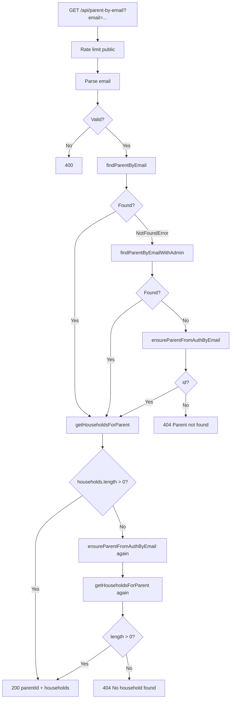
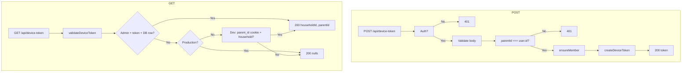
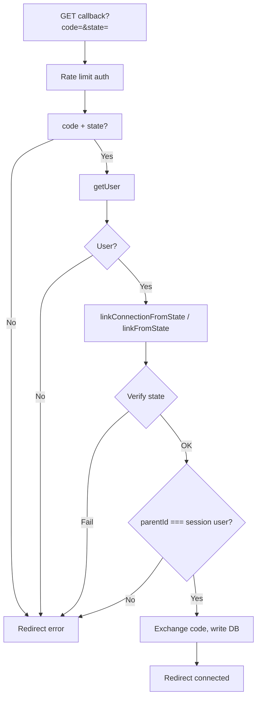

# Optional Phase: Logic Walkthrough (Thinking / Reasoning Model)

**Plan:** Architecture Security Tests Review – Optional phase (thinking/reasoning model)  
**Date:** 2026-02-14  
**Method:** (1) State assumptions at each step, (2) Enumerate branches, (3) Consider races and ordering, (4) Output possible issues with hypothesis and location.  
**Subagent usage:** Senior Software Engineer (reasoning), Code Reviewer ([OPTIONAL_PHASE_CODE_REVIEWER_PASS.md](OPTIONAL_PHASE_CODE_REVIEWER_PASS.md)), Security Reviewer ([OPTIONAL_PHASE_SECURITY_CROSSCHECK.md](OPTIONAL_PHASE_SECURITY_CROSSCHECK.md)).

---

## Flow 1: Parent-by-email (GET /api/parent-by-email)

### Assumptions at each step

| Step | Assumption |
|------|------------|
| 1 | Caller has parent's email; rate limit (public) applies. |
| 2 | `email` is required and valid email format; validator normalizes (trim, toLowerCase). |
| 3 | `parentRepository.findByEmail` uses server client → RLS may hide row for anon. |
| 4 | On NotFoundError: admin client bypasses RLS; `ensureParentFromAuthByEmail` can create parent/household/member. |
| 5 | RPC `ensure_parent_from_auth_email` exists (migration 003); else fallback uses Auth Admin listUsers (max 1000). |
| 6 | Households empty → second `ensureParentFromAuthByEmail` + re-fetch; RPC/fallback create default household. |
| 7 | Response is minimal: parentId + list of { id, name } for households. |

### Branch enumeration

- **Query:** valid email → continue; invalid/missing → 400 (Zod).
- **findParentByEmail:** parent found → parentId; NotFoundError → admin path.
- **Admin path:** findParentByEmailWithAdmin → found → parentId; null → ensureParentFromAuthByEmail → id or null.
- **ensureParentFromAuthByEmail:** RPC success → id; else listUsers + upsert → id or null; null → 404.
- **getHouseholdsForParent:** length > 0 → use; length === 0 → ensure again, re-fetch; still 0 → 404 "No household found".

### Races and ordering

- **Two concurrent requests for same new user:** Both may call `ensureParentFromAuthByEmail`. RPC and fallback use upsert/ON CONFLICT; duplicate inserts are idempotent. Safe.
- **Ordering:** Admin path does not backfill; if admin finds parent but household_members is empty (e.g. legacy data), we rely on second ensure + re-fetch. Redundant call but correct outcome.

### Flow diagram (Mermaid)

### Possible issues

| # | Hypothesis | Location |
|---|------------|----------|
| 1 | Redundant second backfill when admin finds parent but households empty. | `app/api/parent-by-email/route.ts` L48–52 |
| 2 | Fallback listUsers(1000): user not in first 1000 → backfill fails. | `lib/services/parent.service.ts` L69 |

---

## Flow 2: Device token creation and validation

### Assumptions at each step

| Step | Assumption |
|------|------------|
| POST | Caller is authenticated; body has householdId + parentId; route enforces parentId === user.id. |
| POST | ensureMember(householdId, parentId) proves membership; createDeviceToken then stores token (DB if admin) and sets cookie. |
| GET | validateDeviceToken: if admin + token cookie → lookup by hash + expiry; else production → null; dev → parent_id cookie fallback. |

### Branch enumeration

- **POST:** No user → 401; missing householdId/parentId → 400; parentId !== user.id → 401; not member → NotFoundError; else create token → 200.
- **GET:** Admin + valid token cookie + DB row → householdId + parentId; else production → null (200 + nulls); dev + parent_id cookie + valid parent + default household → householdId + parentId; else null.

### Races and ordering

- No critical race: token creation is one insert; validation is read-only. Multiple POSTs for same household create multiple tokens (acceptable).

### Flow diagram (Mermaid)

### Possible issues

| # | Hypothesis | Location |
|---|------------|----------|
| 1 | **Resolved:** parentId === user.id is enforced in route (L41–44). | `app/api/device-token/route.ts` |
| 2 | In dev without service role, identity is cookie-based only. | `lib/services/device-token.service.ts` |

---

## Flow 3: Auth callbacks (YouTube and Child)

### Assumptions at each step

| Step | Assumption |
|------|------------|
| 1 | State is signed (HMAC) and contains householdId, parentId, nonce, exp. |
| 2 | Callback runs after redirect from Google; session must still be valid. |
| 3 | Service verifies state then checks payload.parentId === currentParentId (session user). |

### Branch enumeration

- Missing code or state → redirect admin?youtube=error (or child=error).
- No user → redirect error.
- linkConnectionFromState / linkFromState: invalid signature or expiry → throw → redirect error; parentId !== currentParentId → UnauthorizedError → redirect error; else exchange code, write DB, redirect connected.

### Races and ordering

- OAuth code is one-time; double submit would fail at exchange. State binding to session user prevents cross-user completion.

### Flow diagram (Mermaid)

### Possible issues

| # | Hypothesis | Location |
|---|------------|----------|
| 1 | **Confirmed:** Services enforce payload.parentId === currentParentId (youtube L36–38, child L17–19). | `lib/services/youtube-connection.service.ts`, `lib/services/child-connection.service.ts` |
| 2 | On error, callback redirects without detailed reason; consider safe logging for debugging. | Both callback routes |

---

## Flow 4: Video watch count

### Assumptions at each step

| Step | Assumption |
|------|------------|
| 1 | POST /api/videos/[id]/watch is public (no auth); rate limit applies. |
| 2 | videoService.trackWatch(id) increments watch_count (and updates last_watched_at). |
| 3 | Watch page calls trackWatch once when video is loaded (fetchVideoAndRecommendations). |

### Branch enumeration

- Invalid id (non-UUID) → 400; video not found → 404; else 200 + updated video.

### Races and ordering

- **Double count:** Current code: only watch page calls trackWatch (app/watch/[id]/page.tsx L76). CODE_REVIEW_IN_DEPTH mentioned modal + watch page; if modal ever called trackWatch, one open-modal-then-navigate flow would count twice. As of this review, modal does not call watch API; single count per watch page load. Refreshing watch page would count again (acceptable or add idempotency by product decision).

### Possible issues

| # | Hypothesis | Location |
|---|------------|----------|
| 1 | No auth on watch endpoint: any client with video UUID can increment. Rate limit only mitigation. | `app/api/videos/[id]/watch/route.ts` |
| 2 | Repeated loads of same watch page increment count each time. | Product/UX decision |

---

## Flow 5: Household membership and IDOR

### Assumptions at each step

| Step | Assumption |
|------|------------|
| 1 | Mutation routes that take household_id (or resource under household) call ensureMember(householdId, user.id) with session user. |
| 2 | GET /api/videos?household_id= relies on RLS (current_user_household_ids()); no ensureMember. |
| 3 | POST /api/device-token uses body parentId but enforces parentId === user.id before ensureMember. |

### Branch enumeration

- ensureMember: isMember → continue; !isMember → NotFoundError. All mutation routes checked use user.id from session for membership.

### Possible issues

| # | Hypothesis | Location |
|---|------------|----------|
| 1 | **Resolved:** device-token route enforces parentId === user.id. | `app/api/device-token/route.ts` L41–44 |
| 2 | deleteChild(childId, parentId): service loads child, then ensureMember(child.household_id, parentId). Correct. | `lib/services/child-connection.service.ts` L33–37 |

---

## Summary: optional phase outcomes

- **Parent-by-email:** Redundant second backfill in one branch; listUsers(1000) cap in fallback.
- **Device token:** parentId === user.id enforced; dev cookie-only fallback documented.
- **Auth callbacks:** state bound to session user; optional improvement: safe error logging.
- **Watch count:** No modal double-count in current code; endpoint unauthenticated (rate limit only).
- **Household/IDOR:** ensureMember used consistently; device-token and deleteChild correctly constrained.

---

## Code Reviewer pass (on flow code paths)

**Scope:** Files involved in the five flows (read-only pass per plan).

| File | Findings |
|------|----------|
| `app/api/parent-by-email/route.ts` | [WARNING] Logic is clear; consider extracting "resolve parent + households" into a service function to reduce route size and improve testability. |
| `app/api/device-token/route.ts` | [OK] Validation and auth checks present; no critical/high issues. |
| `app/api/auth/youtube/callback/route.ts`, `app/api/auth/child/callback/route.ts` | [WARNING] console.error in catch; consider structured logger; no sensitive data in logs. |
| `app/api/videos/[id]/watch/route.ts` | [OK] Small, focused; no auth (product decision). |
| `lib/services/parent.service.ts` | [OK] ensureParentFromAuthByEmail fallback listUsers(1000) could be documented in JSDoc. |
| `lib/services/device-token.service.ts` | [OK] Production vs dev behavior clearly separated. |

**Approval:** No CRITICAL or HIGH; optional WARNINGs only.

---

## Security Reviewer cross-check

- **OWASP / checklist:** Input validation (Zod) on all flow inputs; no raw concatenation in queries (Supabase client); auth callbacks verify state and session; device-token creation requires auth and parentId === user.id; rate limiting applied.
- **npm audit:** Run separately (see below); address any high/critical before production.
- **Secrets:** No hardcoded secrets in flow code; env used for Supabase and service role.

---

## npm audit (Security Reviewer)

**Run:** 2026-02-14  
**Result:** 0 vulnerabilities (info/low/moderate/high/critical). No action required.

---

## Next steps

1. ~~Run `npm audit`~~ Done; clean.
2. Optionally: add JSDoc for listUsers(1000) cap in parent.service.ts.
3. Optionally: centralize "require auth + ensureMember" helper (Phase 2 consolidation).
4. Product decision: watch endpoint auth and/or idempotency for trackWatch.
