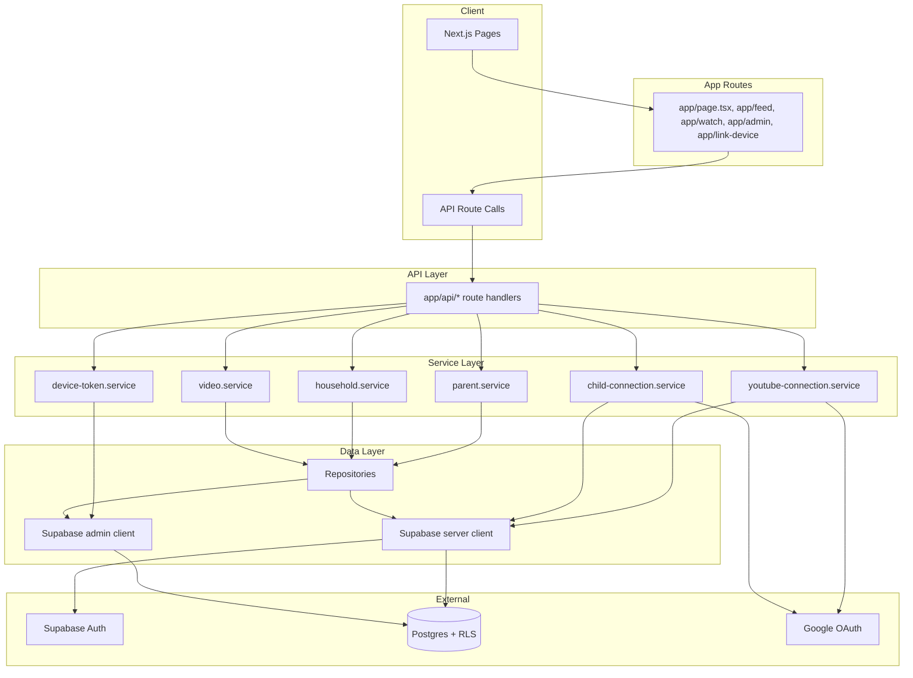

# Phase 1: Architecture Review

**Reviewer:** Software Architect (subagent)  
**Date:** 2026-02-13  
**Scope:** App structure, API layering, data flow, Supabase usage, deployment.

---

## Summary

Voobi is a Next.js 16 app with Supabase (auth + Postgres). Architecture follows a clear **route → service → repository** layering. Auth is dual-mode: parent dashboard uses Supabase Auth (session); kid devices use device-linking (parent-by-email + device token cookie). Deployment targets Docker and Cloudflare (OpenNext).

---

## Architecture Overview

- **API routes** (`app/api/*/route.ts`): validate input (Zod), apply rate limit, auth where needed, call services, return JSON.
- **Services** (`lib/services/*.service.ts`): business logic; use repositories and/or Supabase server/admin clients.
- **Repositories** (`lib/repositories/*.repository.ts`): data access; use server client (session) or admin (bypass RLS when required).
- **Validators** (`lib/validators/*.validator.ts`): Zod schemas for query/body/params.

---

## Technology Stack

| Layer        | Choice              | Notes |
|-------------|----------------------|-------|
| Framework   | Next.js 16           | App Router, server components, API routes |
| Auth        | Supabase Auth        | Parents sign up/login; device linking via token + cookie |
| Database    | Supabase (Postgres)  | RLS on all relevant tables; service role for device_tokens, backfill |
| OAuth       | Google (googleapis)  | YouTube readonly; child identity (openid, email, profile) |
| Rate limit  | Upstash Redis or in-memory | Per-route tiers: public, auth, videoAdd |
| Deployment  | Docker, Cloudflare (OpenNext) | Health check at `/api/health` |

---

## Data Flow (Critical Paths)

1. **Parent signup/login**  
   Admin signup → validate-invite (optional beta code) → Supabase signUp/signIn. Trigger `handle_new_user` syncs `auth.users` → `public.parents`; migration backfill ensures `households` + `household_members` for existing users.

2. **Device linking**  
   Kid device → link-device page → GET `/api/parent-by-email?email=...` (rate-limited, no auth). Lookup: `parentRepository.findByEmail` (RLS) → on 404, `findParentByEmailWithAdmin` then `ensureParentFromAuthByEmail` (RPC or Auth Admin fallback). Then `householdService.getHouseholdsForParent`; if empty, retry ensure + re-fetch. Response: `parentId` + `households`. Parent then chooses household → POST `/api/device-token` (auth) with `householdId` + `parentId` → `ensureMember` then `createDeviceToken` (DB + cookie or cookie-only in dev).

3. **Video list / watch**  
   GET `/api/videos?household_id=...`: uses server client (session); RLS restricts rows to `current_user_household_ids()`. POST `/api/videos/[id]/watch`: no auth check; increments watch count (idempotent per request; modal + watch page can double-count).

4. **YouTube / child OAuth**  
   Init: GET `/api/auth/youtube?household_id=xxx` or `/api/auth/child?household_id=xxx` — auth + `ensureMember`, then signed state (HMAC + expiry), redirect to Google. Callback: GET with `code` + `state` — verify state, exchange code, store connection; redirect to admin.

---

## Security Considerations

- **RLS**: Videos, households, household_members, youtube_connections, household_children all use `current_user_household_ids()` or owner equivalents. `parents` has `USING (true)` for SELECT (needed for public parent-by-email lookup).
- **Service role**: Used only server-side (device_tokens insert/validate, parent/household backfill, household create). Never exposed to client.
- **Secrets**: Supabase URL/keys, Google client, YouTube encryption key, Redis (optional) from env; server validates Supabase URL/key before creating client.
- **OAuth state**: HMAC-signed, expiry 10 min; timing-safe compare in verification.

---

## Trade-offs and Risks

| Decision | Trade-off |
|----------|-----------|
| Public parent-by-email | Enables link-device without auth; exposes only “parent exists” and household list for that email. Acceptable for product; rate-limited. |
| Device token in cookie only (no DB in dev) | Simpler dev; production should use DB-backed tokens. |
| GET /api/videos without explicit auth in route | Relies on RLS; server client carries session so unauthenticated callers get no rows. |
| Watch count in POST /api/videos/[id]/watch | No auth; any client can increment. Mitigated by rate limit and low sensitivity; consider auth or idempotency key if needed. |

---

## Recommendations

1. **Document** the intended deployment order of migrations (001 → 002 if needed → 003) and that 001 already includes service_role grants + `ensure_parent_from_auth_email`.
2. **Consider** centralizing “require auth + ensureMember(householdId)” in a small helper to avoid drift (e.g. one route forgetting ensureMember).
3. **Optional**: Add a one-line comment at GET `/api/videos` and POST `/api/videos/[id]/watch` that access control is enforced by RLS / rate limit respectively.

---

## Files Referenced

- API: `app/api/parent-by-email`, `device-token`, `households`, `videos`, `auth/*`
- Services: `lib/services/parent.service`, `household.service`, `device-token.service`, `video.service`, `youtube-oauth.service`, `child-oauth.service`
- Repos: `lib/repositories/parent.repository`, `household.repository`, `video.repository`
- Supabase: `lib/supabase/server.ts`, `lib/supabase/admin.ts`
- Migrations: `migrations/001_schema.sql`, `002_service_role_grants.sql`, `003_ensure_parent_from_auth.sql`
